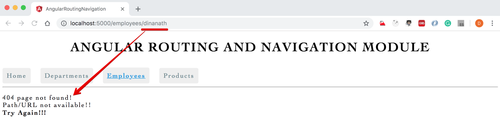

<p align="center">
    
</p>

1 Angular Routing and Navigation 
=====================
- The `Angular Router enables navigation from one view (component)` to the another/next as users perform tasks, views (component)
- Routing simply means navigating between different view (component)
- **RouterModule** 
    - RouterModule helps to `create routes`, which allows us to move from one part of the application to another part or from one view to another
    - A separate NgModule/Angular Module that provides the necessary service providers and directives for navigating through application views
- **Router** 
    - The Angular Router is an `optional service that presents a particular component view` for a given URL, it is not part of the Angular core
    - The Angular Router enables navigation from one view to the another as users perform application tasks/actions 
- **router-outlet**
    - The directive `(<router-outlet>)` that marks where the router displays a view (a container to hold different views/components loaded as users perform application tasks/actions)
- **routerLink**
    - The attribute/directive for binding a clickable HTML element to a route which denotes link/view name to load/show in `(<router-outlet>)`

Let's create below Angular Single Page Application (SPA) with Routing and Navigation feature:
---------------------
<p>
  <figure>
    &nbsp;&nbsp;&nbsp; 
    <figcaption>&nbsp;&nbsp;&nbsp; Image - Output - Angular Single Page Application (SPA) with Routing Navigation - Home View</figcaption>
  </figure>
</p>

<p>
  <figure>
    &nbsp;&nbsp;&nbsp; 
    <figcaption>&nbsp;&nbsp;&nbsp; Image - Output - Angular Single Page Application (SPA) with Routing Navigation - Departments View</figcaption>
  </figure>
</p>

<p>
  <figure>
    &nbsp;&nbsp;&nbsp; 
    <figcaption>&nbsp;&nbsp;&nbsp; Image - Output - Angular Single Page Application (SPA) with Routing Navigation - Employees View</figcaption>
  </figure>
</p>

<p>
  <figure>
    &nbsp;&nbsp;&nbsp; 
    <figcaption>&nbsp;&nbsp;&nbsp; Image - Output - Angular Single Page Application (SPA) with Routing Navigation - Products View</figcaption>
  </figure>
</p>

<p>
  <figure>
    &nbsp;&nbsp;&nbsp; 
    <figcaption>&nbsp;&nbsp;&nbsp; Image - Output - Angular Single Page Application (SPA) with Routing Navigation - Folder structure</figcaption>
  </figure>
</p>

1.Angular Routing Application setup steps:
---------------------
1. Generate a new Angular project/app with routing option
2. Generate departmentList and employeeList, and other required components if any
3. Configure the Routes
4. Add buttons and use a directive to navigate

1.1. Generate a new Angular project/app with routing option
---------------------
- Command to create an Angular app with routing: `ng new routing-demo-app --routing`

- Creating a routing module manually in any existing application:
  1. In index.html file under `<head> tag` add `<base href="/">` (It helps application to build/generate/constructs URL/view to load properly)
  2. In the app, folder create `app-routing.module.ts` file (contains RoutingModule/Routes for application - enter a required path and components details)
  3. import app-routing.module.ts file in `app.module.ts` file also add in the imports array

1.2. Generate required components if any (departmentList and employeeList, and other)
---------------------
- Angular CLI command to generate component: `ng g c employee-list -it -is` (Inline Template / Inline style)
- Angular CLI command to generate component: `ng g c department-list -it -is` and other required components if any

1.3. Configure the Routes
---------------------
- In `app.component.html` add tag/directive: `<router-outlet> </router-outlet>`
- In the app-routing.module.ts file, enter required paths and component details to navigate

1.4. Add buttons and use directive to navigate
---------------------
- In `app.component.html` add links/buttons: `<a routerLink="/home" routerLinkActive="active">Home</a>`
- We can also use `<a routerLink="/home" routerLinkActive="active" routerLinkActiveOptions="{exact:true}">Home</a>` to make current exact link active

> **Syntax & Example**: index.html
```html
<!doctype html>
<html lang="en">

<head>
  <meta charset="utf-8">
  <title>AngularRoutingNavigation</title>
  <base href="/">

  <meta name="viewport" content="width=device-width, initial-scale=1">
  <link rel="icon" type="image/x-icon" href="favicon.ico">
</head>

<body>
  <app-root></app-root>
</body>

</html>
```

> **Syntax & Example**: app-routing.module.ts
```ts
import { NgModule } from '@angular/core';
import { Routes, RouterModule } from '@angular/router';

import { DepartmentListComponent } from './components/department-list/department-list.component';
import { EmployeeListComponent } from './components/employee-list/employee-list.component';
import { HomeComponent } from './components/home/home.component';
import { ProductListComponent } from './components/product-list/product-list.component';

const routes: Routes = [
  // default path
  // { path: '', component:DepartmentListComponent},
  { path: 'home', component: HomeComponent },
  { path: 'departments', component: DepartmentListComponent },
  { path: 'employees', component: EmployeeListComponent },
  { path: 'products', component: ProductListComponent },
];

@NgModule({
  imports: [RouterModule.forRoot(routes)],
  exports: [RouterModule]
})
export class AppRoutingModule { }

// to store all routing component and avoid importing/writing duplicate list of components in app.routing.module / app.module.
// create an array of all routing components export it, then import it in app.module.ts
export const RoutingComponents = [
  DepartmentListComponent,
  EmployeeListComponent,
  HomeComponent,
  ProductListComponent,
]
```

> **Syntax & Example**: app.module.ts
```ts
import { BrowserModule } from '@angular/platform-browser';
import { NgModule } from '@angular/core';

import { AppRoutingModule, RoutingComponents } from './app-routing.module';
import { AppComponent } from './app.component';

// RoutingComponents array - list all the components used in application 

// import { DepartmentContactComponent } from './components/department-contact/department-contact.component';
// import { DepartmentDetailsComponent } from './components/department-details/department-details.component';
// import { DepartmentListComponent } from './components/department-list/department-list.component';
// import { DepartmentOverviewComponent } from './components/department-overview/department-overview.component';
// import { EmployeeListComponent } from './components/employee-list/employee-list.component';
// import { HomeComponent } from './components/home/home.component';
// import { ProductListComponent } from './components/product-list/product-list.component';
// import { WildcardPagenotfoundComponent } from './components/wildcard-pagenotfound/wildcard-pagenotfound.component';

@NgModule({
  declarations: [
    AppComponent,
    RoutingComponents,
    // DepartmentDetailsComponent,
    // DepartmentContactComponent,
    // DepartmentOverviewComponent,
    // DepartmentListComponent,
    // EmployeeListComponent,
    // HomeComponent,
    // ProductListComponent,
    // WildcardPagenotfoundComponent

  ],
  imports: [
    BrowserModule,
    AppRoutingModule
  ],
  providers: [],
  bootstrap: [AppComponent]
})
export class AppModule { }
```

> **Syntax & Example**: app.component.html
```html
<!--The content below is only a placeholder and can be replaced.-->
<h1 style="text-align:center;">{{ appTitle }}</h1>

<!-- add buttons/links to navigate pages or routings -->
<nav>
  <a routerLink="/home" routerLinkActive="active" routerLinkActiveOptions="{exact:true}">Home</a>
  &nbsp;&nbsp;
  <a routerLink="/departments" routerLinkActive="active" routerLinkActiveOptions="{exact:true}">Departments</a>
  &nbsp;&nbsp;
  <a routerLink="/employees" routerLinkActive="active" routerLinkActiveOptions="{exact:true}">Employees</a>
  &nbsp;&nbsp;
  <a routerLink="/products" routerLinkActive="active" routerLinkActiveOptions="{exact:true}">Products</a> &nbsp;&nbsp;
</nav>

<hr />

<!-- ng new routing-demo-app --routing  - defulat include router-outlet in app.component.html. routed views goes here -->
<router-outlet></router-outlet>
```

> **Syntax & Example**: app.component.ts
```ts
import { Component } from '@angular/core';

@Component({
  selector: 'app-root',
  templateUrl: './app.component.html',
  styleUrls: ['./app.component.css']
})
export class AppComponent {
  public appTitle = 'Angular Routing and Navigation Module';
}
```

> **Syntax & Example**: styles.css
```css
/* You can add global styles to this file, and also import other style files */

/* common global generic styles */
.custom-divider {
  margin: 30px 0px;
  border-bottom:2px dashed gray;
}

h1,h2,h3 {
  text-transform: uppercase;
  /* text-transform: capitalize; */
}

h2 {
  text-decoration: underline;
}

body {
  font-family: Cambria, Cochin, Georgia, Times, 'Times New Roman', serif;
  letter-spacing: 2px;
}

li {
  margin: 10px 0px;
}

input {
  padding: 5px;
}

button {
  border-radius: 5px;
  padding: 10px 15px;
  background-color: teal;
  border: none;
  outline: none;
  cursor: pointer;
  color: lightcyan;
}

.button-sub {
  background-color: rgba(0, 128, 128, 0.6);
  color: white;
}

/* route and navigation - links */
nav a {
  padding:10px;
  text-decoration: none;
  margin-top: 10px;
  display: inline-block;
  background-color: #eeeeee;
  border-radius: 4px;
}

nav a:visited, a:link, a {
  color:#607D8B;
}

nav a:hover {
  color:#039be5;
  background-color: #CFD8DC;
}

nav a.active {
  color:#039be5;
  font-weight: bold;
  text-decoration: underline;
}

/* route and navigation - list badge */
.items {

}

.items li, .link-sub {
  width: 200px;
  cursor: pointer;
  width: 150px;
  padding: 10px;
  text-decoration: none;
  margin-top: 10px;
  background-color: #eeeeee;
  border-radius: 4px;
}

.badge {
  background: teal;
  padding: 10px;
  margin-right: 5px;
  position: relative;
  left: -10px;
  border-radius: 4px 0px 0px 4px;
}

.description {

}

/* optional parameter - show highlighted */
.items li.selected {
  color:#039be5;
  background-color: #CFD8DC;
}
```

2 Wildcard Route and Redirecting Routes (Dealing with unavailable-non-configured route [Page not found])
=====================
- User can type/enter any unavailable-non-configured route/URL and can get many erros in console, like `http://localhost:5000/try` **Error:** `(Cannot match any routes, URL segment 'try'...)`
- To deal/handle any unwanted path or unavailable routes we must need to create a new component named `page not found component` OR `404 component` and `add 'wildcard **'` route
- `Wildcard **` routes or any paths with parameters (employees/1 or routes/parameters) `must come last` in `app-routing.module.ts` router configuration as router tries to match the paths from top to bottom
- In `app-routing.module.ts` route must be configured in order: `most specific at the tpo to list important/specific at the bottom` 
- **Default Route:** While using `wildcard **` routes we also need to provide `default route like '{ path: '', component:DepartmentListComponent}' OR  '{ path: '', redirectTo:'departments', pathMatch:'full'}'`
<br/> <br/>

Steps:
- Create a new component for page not found: `ng g c wildcard-pagenotfound` with a instructional markup: `404 page not found!`
- In `app-routing.module.ts` at the bottom/last add a new wildcard route: `{ path: '**', component: WildcardPagenotfoundComponent }`

> **Syntax & Example**: wildcard-pagenotfound.component.html
```html
<p>
  404 page not found! <br/>
  Path/URL not available!! <br/>
  <strong>Try Again!!!</strong>  
</p>

```

> **Syntax & Example**: app-routing.module.ts
```ts
import { NgModule } from '@angular/core';
import { Routes, RouterModule } from '@angular/router';

import { DepartmentListComponent } from './components/department-list/department-list.component';
import { EmployeeListComponent } from './components/employee-list/employee-list.component';
import { HomeComponent } from './components/home/home.component';
import { ProductListComponent } from './components/product-list/product-list.component';
import { WildcardPagenotfoundComponent } from './components/wildcard-pagenotfound/wildcard-pagenotfound.component';

const routes: Routes = [
  // default path
  // { path: '', component:DepartmentListComponent},
  { path: 'home', component: HomeComponent },
  { path: '', redirectTo: 'home', pathMatch: 'full' },
  { path: 'departments', component: DepartmentListComponent },
  { path: 'employees', component: EmployeeListComponent },
  { path: 'products', component: ProductListComponent },
  { path: '**', component: WildcardPagenotfoundComponent }
];

@NgModule({
  imports: [RouterModule.forRoot(routes)],
  exports: [RouterModule]
})
export class AppRoutingModule { }

// to store all routing component and avoid importing/writing duplicate list of components in app.routing.module / app.module.
// create an array of all routing components export it then imports it in app.module.ts
export const RoutingComponents = [
  DepartmentListComponent,
  EmployeeListComponent,
  HomeComponent,
  ProductListComponent,
  WildcardPagenotfoundComponent,
]
```

<p>
  <figure>
    &nbsp;&nbsp;&nbsp; 
    <figcaption>&nbsp;&nbsp;&nbsp; Image - Output - wildcard-route / Page not found!</figcaption>
  </figure>
</p>

<p>
  <figure>
    &nbsp;&nbsp;&nbsp; 
    <figcaption>&nbsp;&nbsp;&nbsp; Image - Output - wildcard-route / Page not found!</figcaption>
  </figure>
</p>
        
3 Route Parameters 
=====================
- In this section will learn to pass and read route parameters, as given below:
  - http://localhost:4200/departments/production
  - http://localhost:4200/user/1
  - http://localhost:4200/employee/100
1. In `app-routing.module.ts` create `departments/:id` path route parameters for items under department list component 
2. In `department-list.component.ts` class file create a array of departments object
3. In `department-list.component.html` view file iterate/*ngFor through departments array and pass departments id as a route parameter
    - on click of the department list item, it will take to `department-details.component page with selected department id`, at the same time browser location path will be displayed as `localhost:5000/department:2 (selected department id )`
    - To navigate from code/links/buttons we need `router service as a dependency`
4. Create and use a new component to show details: `department-details.component.ts` - read the departments id passed as a parameter and show the route view accordingly
    - `activatedRoute.snapshot.paramMap.get()` is used to read the routes/parameters passed

> **Syntax & Example**: department-list.component.ts
```ts
import { Component, OnInit } from '@angular/core';
import { Router } from '@angular/router';

@Component({
  selector: 'app-department-list',
  templateUrl: './department-list.component.html',
  styleUrls: ['./department-list.component.css']
})
export class DepartmentListComponent implements OnInit {
  public departments = [
    { 'id': 1, 'name': 'JavaScript' },
    { 'id': 2, 'name': 'Angular' },
    { 'id': 3, 'name': 'NodeJS' },
    { 'id': 4, 'name': 'ReactJS' },
    { 'id': 5, 'name': 'VueJs' },
  ]
  
  constructor(private router: Router) { }

  ngOnInit() {

  }

  onLinkSelect(curDepartment) {
    console.log('onLinkSelect curDepartment');
    // navigate ( path, route parameter)
    this.router.navigate(['departments', curDepartment.id]);
  }

}
```

> **Syntax & Example**: department-list.component.html
```html
<div>
  <h3>Department list:</h3>

  <ul class="items">
    Click on department to see more details:
    <!-- on link click call function/method to navigate -->
    <li *ngFor="let department of departments" (click)="onLinkSelect(department)">
      <span class="badge">{{department.id}}</span>
      <span class="description">{{department.name}}</span>
    </li>
  </ul>

</div>
```

> **Syntax & Example**: app-routing.module
```ts
import { NgModule } from '@angular/core';
import { Routes, RouterModule } from '@angular/router';

import { DepartmentDetailsComponent } from './components/department-details/department-details.component';
import { DepartmentListComponent } from './components/department-list/department-list.component';
import { EmployeeListComponent } from './components/employee-list/employee-list.component';
import { HomeComponent } from './components/home/home.component';
import { ProductListComponent } from './components/product-list/product-list.component';
import { WildcardPagenotfoundComponent } from './components/wildcard-pagenotfound/wildcard-pagenotfound.component';

const routes: Routes = [
  // default path
  // { path: '', component:DepartmentListComponent},
  { path: 'home', component: HomeComponent },
  { path: '', redirectTo: 'home', pathMatch: 'full' },
  { path: 'departments', component: DepartmentListComponent },
  { path: 'departments/:id', component: DepartmentDetailsComponent },
  { path: 'employees', component: EmployeeListComponent },
  { path: 'products', component: ProductListComponent },
  { path: '**', component: WildcardPagenotfoundComponent }
];

@NgModule({
  imports: [RouterModule.forRoot(routes)],
  exports: [RouterModule]
})
export class AppRoutingModule { }

// to store all routing component and avoid importing/writing duplicate list of components in app.routing.module / app.module.
// create an array of all routing components export it then imports it in app.module.ts
export const RoutingComponents = [
  DepartmentDetailsComponent,
  DepartmentListComponent,
  EmployeeListComponent,
  HomeComponent,
  ProductListComponent,
  WildcardPagenotfoundComponent,
]
```

> **Syntax & Example**: department-details.component.ts
```ts
import { Component, OnInit } from '@angular/core';
import { ActivatedRoute } from '@angular/router';

@Component({
  selector: 'app-department-details',
  templateUrl: './department-details.component.html',
  styleUrls: ['./department-details.component.css']
})
export class DepartmentDetailsComponent implements OnInit {
  // to hold the currently passed id parameter
  public selectedDepartmentId;

  constructor(private activatedRoute: ActivatedRoute) { }

  ngOnInit() {
    // read the route parameter

    // snapshot approach 
    console.log(this.activatedRoute.snapshot.paramMap);
    let routeParamId = parseInt(this.activatedRoute.snapshot.paramMap.get('id'));
    this.selectedDepartmentId = routeParamId;
  }

}
```

> **Syntax & Example**: department-details.component.html
```html
<h3>Selected Deparment Details ID : {{ selectedDepartmentId }} </h3>
```

<p>
  <figure>
    &nbsp;&nbsp;&nbsp; 
    <figcaption>&nbsp;&nbsp;&nbsp; Image - Output - Route P arameters Department List</figcaption>
  </figure>
</p>

<p>
  <figure>
    &nbsp;&nbsp;&nbsp; 
    <figcaption>&nbsp;&nbsp;&nbsp; Image - Output - Route P arameters Department Clicked/Selected</figcaption>
  </figure>
</p>
        
